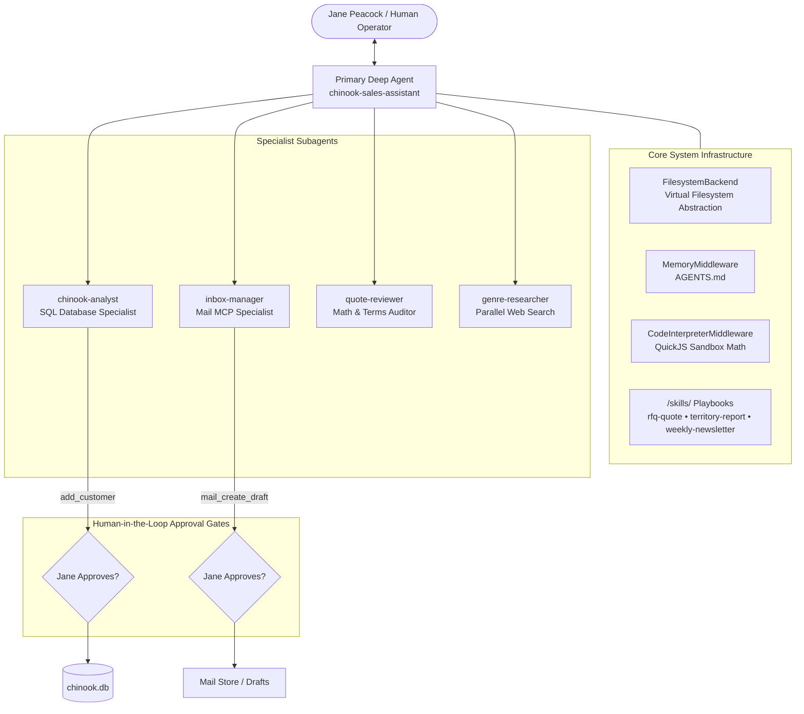

# 🎵 Chinook Sales Assistant — Autonomous Multi-Agent System (LangChain deepagents)

An enterprise-grade, multi-agent sales assistant built with **LangChain (`deepagents`)** and **LangGraph**, designed to automate sales operations for **Jane Peacock** (Sales Support Agent at Chinook, an online digital music distributor).

The assistant automates **Request for Quote (RFQ) email processing**, **territory sales performance reporting**, and **weekly music newsletter production** while maintaining **strict financial accuracy**, **database trust boundaries**, and **Human-in-the-Loop (HITL) approval gates**.

---

## 🌟 Key Features & Architecture Highlights

* **Hierarchical Subagent Delegation**: A central primary agent coordinates four domain-specialized subagents running in clean, isolated context windows.
* **Human-in-the-Loop (HITL) Approval Gates**: Sensitive write operations (`mail_create_draft` and `add_customer`) pause automatically for human review before execution.
* **Model Context Protocol (MCP)**: Integrates email mailbox tools via a FastMCP server over HTTP streamable transport (`http://127.0.0.1:5002/mcp`).
* **Zero Financial Hallucination**: Quote arithmetic and volume discounts are computed using a sandboxed QuickJS/Python Code Interpreter.
* **XSS-Sanitized HTML Deliverables**: Newsletter HTML generation uses `nh3` allowlist sanitization to strip malicious scripts from untrusted web search results.
* **Deterministic Skill Playbooks**: Task steps are driven by plain-text instructions loaded from `/skills/` (`rfq-quote`, `territory-report`, `weekly-newsletter`).

---

## 🏗️ Architecture Diagram



---

## 📁 Directory Structure & Key Files

```text
Sales_assistant/
├── agent.py            # Primary agent entrypoint & graph compiler (make_graph)
├── subagents.py        # 4 specialist subagents (analyst, inbox, reviewer, researcher)
├── langgraph.json      # LangGraph Dev server configuration manifest
├── USER_GUIDE.md       # Comprehensive prompt playbook & database schema guide
├── AGENTS.md           # Operating manual & global system instructions
├── pyproject.toml      # Dependency specifications (deepagents, langchain, fastmcp)
├── start.sh            # Shell launch script for Unix/Linux environments
├── skills/             # Plain-text task playbooks
│   ├── rfq-quote/           # Step-by-step quote processing instructions
│   ├── territory-report/    # Territory metrics & chart generation instructions
│   └── weekly-newsletter/   # Parallel genre research & newsletter assembly
├── tools/              # Custom tool implementations
│   ├── sql.py               # Read-only SQLite query, schema introspection & customer insertion
│   ├── html.py              # nh3 sanitized Markdown-to-HTML converter
│   ├── chart.py             # Matplotlib pie chart generator
│   └── search.py            # Tavily news search wrapper
├── mcp/                # Mock Mail FastMCP HTTP Server
│   ├── mock_mail_server.py  # FastMCP server running on port 5002
│   ├── mail_store.py        # Persistent JSON mailbox manager
│   ├── send_to_inbox.py     # CLI tool to inject incoming customer emails
│   └── seeds/               # Seed JSON email fixtures (RFQ requests)
├── outputs/            # Deliverables output folder (generated reports, charts, newsletters)
└── data/
    └── chinook.db      # SQLite database (Employee, Customer, Invoice, Track, Genre, etc.)
```

---

## ⚡ Core Business Workflows

### 1. 📧 Request for Quote (RFQ) Processing
1. Reads incoming customer emails via `inbox-manager` (`mail_list_messages`, `mail_read_message`).
2. Checks customer existence in `chinook.db` via `chinook-analyst`. If missing, calls `add_customer` (**HITL Pause for Approval**).
3. Queries track unit prices ($0.99 standard).
4. Computes line totals and volume discounts (e.g. 10% off for 50+ tracks) using **Code Interpreter**.
5. Audits terms and math using `quote-reviewer`.
6. Saves draft reply via `inbox-manager` (`mail_create_draft`) (**HITL Pause for Approval**).
7. Logs transaction to `/outputs/quotes_ledger.md`.

### 2. 📊 Sales & Territory Performance Reporting
1. Queries `chinook.db` for Jane Peacock (`SupportRepId = 3`) sales metrics.
2. Calculates revenue totals, invoice counts, top spending clients, and revenue by genre.
3. Outputs Markdown report: `/outputs/territory_report-YYYY-MM-DD.md`.
4. Renders pie chart: `/outputs/territory_chart.png`.

### 3. 📰 Weekly Music Newsletter Production
1. Identifies top-selling music genres across the catalog.
2. Spawns parallel `genre-researcher` subagents to perform web research via Tavily.
3. Assembles Markdown content and converts to HTML via `markdown_to_html`.
4. Sanitizes output with `nh3` to prevent XSS script injection.
5. Saves HTML deliverable: `/outputs/newsletter-<timestamp>.html`.

---

## 🚀 Setup & Execution Guide

### Prerequisites
* **Python**: `3.13+`
* **Package Manager**: [`uv`](https://github.com/astral-sh/uv)

### 1. Installation
Clone the repository and install dependencies using `uv`:
```bash
git clone <repository-url>
cd Sales_assistant
uv sync
```

### 2. Environment Configuration
Create a `.env` file in the root directory (refer to `.env.example`):
```env
OPENAI_API_KEY="sk-proj-..."
TAVILY_API_KEY="tvly-dev-..."      # Optional: Required for web newsletter research
LANGSMITH_API_KEY="lsv2_pt_..."    # Optional: For tracing & telemetry
LANGSMITH_TRACING="true"
LANGSMITH_PROJECT="Sales_Assistant"
```

---

### 3. Running the Project

To run the application, start **two terminal windows**:

#### Terminal 1: Start Mock Mail MCP Server
```bash
uv run python mcp/mock_mail_server.py
```
*Output:*
```text
INFO: Application startup complete.
INFO: Uvicorn running on http://127.0.0.1:5002
```

#### Terminal 2: Start LangGraph Dev Server
```bash
uv run langgraph dev
```
*Output:*
```text
🚀 API: http://127.0.0.1:2024
🎨 Studio UI: https://smith.langchain.com/studio/?baseUrl=http://127.0.0.1:2024
```

---

### 4. Injecting Test Emails
To test incoming customer emails (e.g. bulk track license RFQs):
```bash
# Inject sample RFQ emails into Jane's inbox
uv run python mcp/send_to_inbox.py

# Or reset mailbox state to default seeds
uv run python mcp/send_to_inbox.py --reset
```

---

## 🔒 Security & Trust Boundaries

* **Read-Only SQLite Execution**: `query_chinook` uses SQLite `mode=ro` URI parameter combined with an explicit query blocklist (`_FORBIDDEN` write keywords) to prevent unauthorized database modifications.
* **Parameterized Customer Creation**: `add_customer` uses strict SQL parameterization and hardcodes `SupportRepId = 3` server-side.
* **XSS Defense**: External web search text used in newsletters is sanitized with `nh3` allowlist cleaning prior to HTML template embedding.
* **Isolated File Access**: `genre-researcher` subagents are restricted via `FilesystemPermission` to read/write strictly under `/research/**`.

---

## 📄 License & Attribution

Built with ❤️ using **LangChain DeepAgents**, **LangGraph**, and **FastMCP**.
