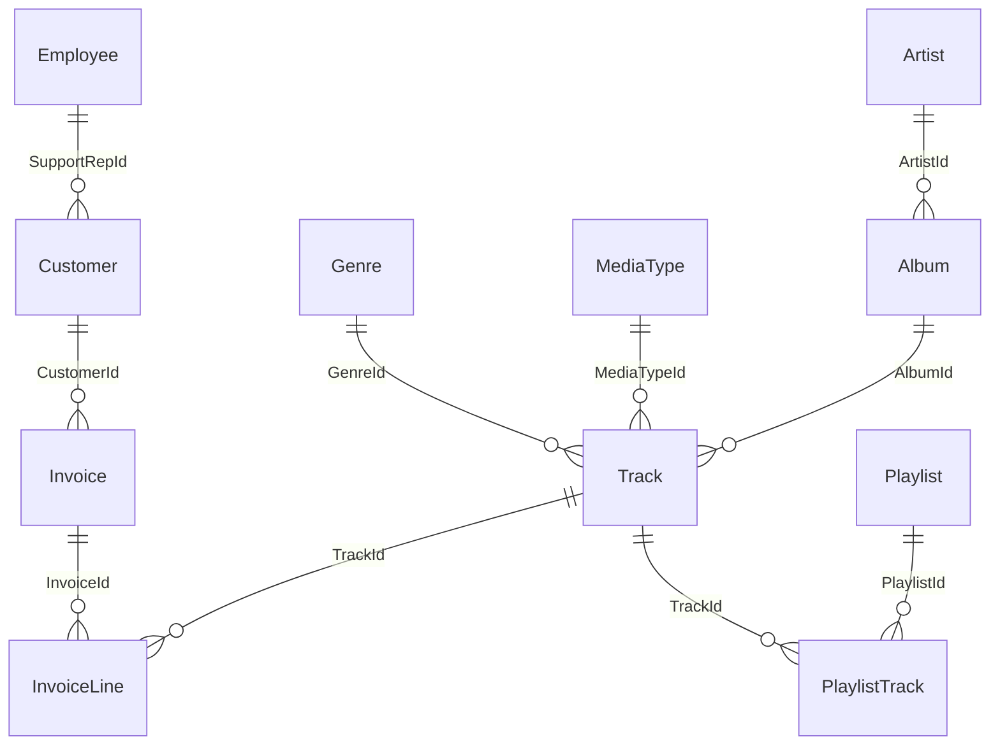

# Chinook Sales Assistant — User Guide & Prompting Playbook

Welcome to the **Chinook Sales Assistant** User Guide! This document provides a comprehensive overview of how to interact with the assistant, what questions you can ask, sample prompt variations across core business capabilities, and a full breakdown of the underlying **Chinook Database Schema**.

---

## 🧑‍💼 Persona & Operating System

The assistant is configured as an AI co-pilot for **Jane Peacock** (`EmployeeId = 3`), a Sales Support Agent at **Chinook** (an online digital music distributor).

### Key Rules to Remember:
* **Jane's Portfolio**: When asking about "my customers", "my territory", or "our sales", the assistant automatically filters data for `SupportRepId = 3`.
* **Human-in-the-Loop (HITL)**: Two sensitive actions will **pause for your explicit approval** in the UI:
  1. **Saving an Email Draft** (`mail_create_draft`)
  2. **Adding a New Customer to DB** (`add_customer`)
* **Exact Math**: Quote arithmetic and totals are computed using an isolated Code Interpreter to prevent calculation errors.

---

## 🗄️ Database Schema & Table Details (`chinook.db`)

The Chinook database models a digital media store. Below is the breakdown of all 11 tables, their key columns, and their relationships:

### Table Reference Table

| Table Name | Description | Key Columns & Foreign Keys |
| :--- | :--- | :--- |
| **`Customer`** | Customer records & rep assignments | `CustomerId` (PK), `FirstName`, `LastName`, `Company`, `Email`, `Phone`, `City`, `Country`, `SupportRepId` (FK $\rightarrow$ `Employee`) |
| **`Employee`** | Staff members & org structure | `EmployeeId` (PK), `FirstName`, `LastName`, `Title` (*Sales Support Agent*), `ReportsTo`, `Email` |
| **`Invoice`** | Sales transaction headers | `InvoiceId` (PK), `CustomerId` (FK), `InvoiceDate`, `BillingAddress`, `BillingCity`, `BillingCountry`, `Total` |
| **`InvoiceLine`** | Purchased line items per invoice | `InvoiceLineId` (PK), `InvoiceId` (FK), `TrackId` (FK), `UnitPrice`, `Quantity` |
| **`Track`** | Song/track catalogue details | `TrackId` (PK), `Name`, `AlbumId` (FK), `MediaTypeId` (FK), `GenreId` (FK), `Composer`, `Milliseconds`, `UnitPrice` |
| **`Genre`** | Music genres | `GenreId` (PK), `Name` (*Rock, Jazz, Metal, Blues, Pop, etc.*) |
| **`Album`** | Music albums | `AlbumId` (PK), `Title`, `ArtistId` (FK) |
| **`Artist`** | Recording artists / bands | `ArtistId` (PK), `Name` |
| **`MediaType`** | Audio format types | `MediaTypeId` (PK), `Name` (*MPEG audio, AAC, etc.*) |
| **`Playlist`** | Curated track lists | `PlaylistId` (PK), `Name` |
| **`PlaylistTrack`** | Many-to-many link | `PlaylistId` (FK), `TrackId` (FK) |

---

## ❓ What Questions Can You Ask? (Categories & Examples)

You can interact with the assistant using natural language prompts. Below are the primary capabilities and different ways to phrase requests.

---

### Category 1: Request for Quote (RFQ) & Mail Processing 📧

Processes customer quote requests from Jane's inbox, verifies pricing, runs exact arithmetic, passes review, and creates an email draft.

#### Example Prompts & Phrasings:
* **Standard Email Check**:
  > *"Check my inbox for new quote requests and process them."*
* **Targeted Customer Quote**:
  > *"Look for an email from Morgan Vale and prepare a price quote for their track request."*
* **Specific Order Request**:
  > *"Process a quote for 40 Rock tracks and 25 Metal tracks for Northern Lights Cafes, applying a 10% bulk discount."*
* **Draft Status Check**:
  > *"Summarize the quote request waiting in my inbox and draft a reply."*

#### What Happens Under the Hood:
1. `inbox-manager` subagent reads inbox via `mail_list_messages` & `mail_read_message`.
2. `chinook-analyst` checks `Customer` table by email. If missing, calls `add_customer` (**HITL Pause**).
3. `chinook-analyst` fetches track unit prices ($0.99 standard).
4. Code Interpreter computes line item totals, applies volume discounts (e.g. 10% for 50+ tracks), and calculates the grand total.
5. `quote-reviewer` audits the math.
6. `inbox-manager` calls `mail_create_draft` (**HITL Pause**).
7. Appends output line to `/outputs/quotes_ledger.md`.

---

### Category 2: Territory & Sales Reporting 📊

Generates sales metrics and summaries for Jane's assigned customer portfolio.

#### Example Prompts & Phrasings:
* **Territory Sales Overview**:
  > *"Generate a territory sales report for my book of business."*
* **Performance Summary**:
  > *"How is my territory performing this year? Show total revenue, invoice counts, and top customers."*
* **Genre Sales Breakdown with Chart**:
  > *"Create a sales summary for Jane Peacock including top revenue genres and render a pie chart."*
* **Top Customers Query**:
  > *"Who are my top 5 highest spending customers, and how much total revenue did each generate?"*

#### Output Deliverables:
* Written Markdown report: `/outputs/territory_report-YYYY-MM-DD.md`
* Pie chart image: `/outputs/territory_chart.png`

---

### Category 3: Weekly Music Newsletter & Market Research 📰

Runs parallel web research across music genres and generates a styled, sanitized HTML newsletter.

#### Example Prompts & Phrasings:
* **Standard Weekly Newsletter**:
  > *"Create the weekly 'This Week in Music' customer newsletter."*
* **Custom Genre Newsletter**:
  > *"Write a weekly music newsletter featuring Jazz, Rock, Blues, and Heavy Metal."*
* **Market Trends Research**:
  > *"Research top news and album releases in Rock and Latin music for our weekly customer update."*

#### Output Deliverables:
* HTML file: `/outputs/newsletter-YYYY-MM-DD-HH-MM-SS.html` (Sanitized via `nh3` against malicious scripts).

---

### Category 4: Customer Record Management 👤

Look up customer accounts or add new clients to Jane's territory.

#### Example Prompts & Phrasings:
* **Customer Lookup**:
  > *"Find customer record for email morgan.vale@northern-lights-cafes.example."*
* **Add Customer**:
  > *"Add a new customer named Alex Rivera from Boston, USA with email alex@example.com."*
* **List Territory Clients**:
  > *"List all customers assigned to me (Jane Peacock) and their locations."*

*(Note: Adding a customer triggers a Human-in-the-Loop approval prompt before writing to disk).*

---

### Category 5: Direct Database & Catalogue Queries 🎶

Query music tracks, artists, albums, or invoice details.

#### Example Prompts & Phrasings:
* **Track Lookup**:
  > *"What are the top 10 best-selling tracks in the database?"*
* **Genre Exploration**:
  > *"Which music genres have the most available tracks in our catalogue?"*
* **Artist & Album Search**:
  > *"How many tracks do we have by AC/DC, and what albums are they on?"*
* **Invoice History**:
  > *"Show recent invoice totals for customer Luis Gonçalves."*

---

## 💡 Best Practices for Prompting

1. **Be Specific About Deliverables**: Mention if you want an email draft, a markdown report, or a chart.
2. **Specify Discounts or Quantities**: If creating custom quotes, state volume discounts explicitly (e.g. *"10% discount for orders over 50 tracks"*).
3. **Approve HITL Prompts**: When the agent requests permission to save a draft or add a customer, click **Approve** in the UI to allow execution.
4. **Use Output Files**: Check the `/outputs/` folder in your workspace for generated HTML newsletters, markdown reports, and PNG charts.
